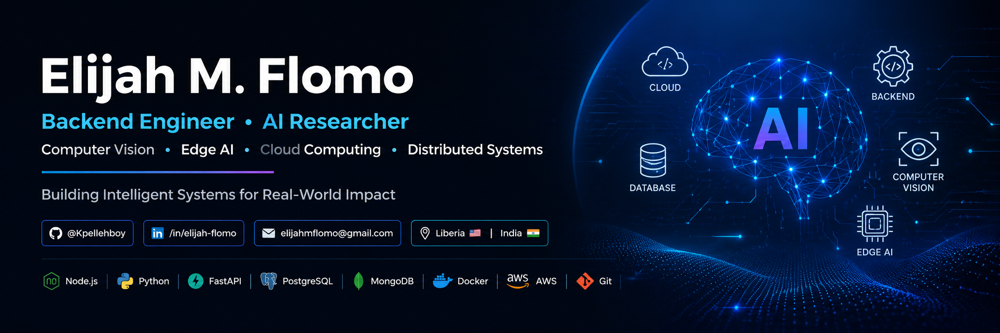

  

<h1 align="center">Hi 👋, I'm Elijah M. Flomo</h1>

<h3 align="center">
AI Researcher • Backend Engineer • M.Sc. Computer Science Student
</h3>

Computer Vision • Edge AI • Backend Systems • Efficient AI

  
  
  
  

---

## 👨‍💻 About Me

I'm an **M.Sc. Computer Science student at SR University** with research interests in **Computer Vision, Edge AI, and Efficient AI**.

My work sits at the intersection of **AI research and backend engineering**. I enjoy turning research ideas into practical systems, designing scalable APIs, working with data-intensive applications, and building software that addresses real-world problems.

I am particularly interested in systems that combine **intelligent models, efficient computation, and reliable backend infrastructure**.

* 🎓 M.Sc. Computer Science — SR University, India
* 🔬 Research interests — Computer Vision, Edge AI, Efficient AI
* 💻 Backend — Python, FastAPI, Flask, Node.js, Express.js
* 🗄️ Databases — PostgreSQL, MongoDB, MySQL
* ☁️ Interests — Cloud Computing, Backend Systems, AI Infrastructure
* 📄 First Author — IEEE INCECT 2026 accepted paper
* 🤝 Open to research collaborations, internships, and selected open-source projects

---

## 🏢 Production Experience

### Innovation Matrix — Production Backend Platform

**Backend Engineer / Student Developer**

Designed and developed the backend platform for **Innovation Matrix**, a nonprofit organization based in Liberia.

The backend is built as a production-oriented REST API supporting the organization's website and administrative operations.

### Key Contributions

* Designed a scalable backend architecture using **Node.js, TypeScript, and Express.js**
* Designed and implemented a **PostgreSQL relational database**
* Implemented database access using **Prisma ORM**
* Built **JWT-based authentication and refresh-token workflows**
* Implemented **role-based access control**
* Developed modular CRUD APIs for organizational content
* Implemented **News, Programs, Categories, Resources, Team, and Board management**
* Built **media management using Cloudinary**
* Implemented **Redis caching** for performance-sensitive operations
* Added **Zod request validation**
* Designed standardized API responses and centralized error handling
* Integrated **Swagger / OpenAPI** documentation
* Implemented security middleware including authentication, authorization, rate limiting, and request validation
* Designed an optimized **homepage aggregation API**
* Implemented testing for authentication, authorization, CRUD operations, validation, database consistency, security, and performance

### Technology

  

**Additional technologies:** Prisma • JWT • Zod • Cloudinary • Swagger/OpenAPI • Jest • Supertest • Winston

> 🔒 **Client-owned production code:** The production repository is private and is not publicly distributed. This profile describes my technical contribution without exposing client source code, credentials, or confidential infrastructure.

---

## 🔬 Research Interests

* Computer Vision
* Edge AI
* Efficient AI
* Lightweight Deep Learning
* Intelligent Systems
* Machine Learning
* Cloud Computing
* Network & Information Security

---

## 🚀 Current Focus

* 🔬 AI Research
* 👁️ Computer Vision
* ⚡ Edge AI & Efficient AI
* 🧠 Machine Learning
* 🏗️ Backend System Design
* ☁️ Cloud & Scalable Systems
* 🌐 Open Source Development

---

## 💻 Tech Stack

### Programming Languages

  

### AI & Machine Learning

  

### Backend Development

  

### Databases & Infrastructure

  

### Tools & Platforms

  

---

## 🚀 Featured Projects

| Project                                          | Description                                                                                        |
| ------------------------------------------------ | -------------------------------------------------------------------------------------------------- |
| 🌱 **Plant Disease Detection using MobileNetV2** | Multiclass plant disease classification using a lightweight MobileNetV2 architecture.              |
| 👁️ **Real-Time Object Detection using YOLOv8**  | Real-time object detection system built with the YOLOv8 framework.                                 |
| 🤖 **AI Commerce Assistant API**                 | Backend API supporting AI-assisted product search and recommendations.                             |
| 📄 **RAG Document Intelligence API**             | Retrieval-Augmented Generation API for intelligent document interaction and information retrieval. |
| 🧠 **AI Research Agent**                         | AI-powered research assistant for information gathering and analysis.                              |
| 🌐 **Personal Portfolio**                        | Personal portfolio showcasing projects, research, technical work, and publications.                |

---

## 📚 Publications

### 📄 Automated Classification of Multiclass Plant Disease Using MobileNetV2

**IEEE INCECT 2026**

* First Author
* Accepted for presentation and publication

---

### 📄 Promise and Limits of Cross-Architecture Knowledge Distillation for Ultra-Lightweight Medical Vision Transformers at the Edge

**EDIGE 2026**

* Second Author
* Submitted

---

## 📊 GitHub Statistics

  

  

---

## 📈 Contribution Activity

  

---

## 🌱 Currently Learning

* Advanced Computer Vision
* Edge AI
* Efficient Deep Learning
* Backend System Design
* Cloud Architecture
* Distributed Systems

---

## 🤝 Looking to Collaborate

I'm interested in collaborating on:

* 🔬 Artificial Intelligence Research
* 👁️ Computer Vision
* ⚡ Edge AI
* 🏗️ Backend Engineering
* ☁️ Cloud & Distributed Systems
* 🌐 Open Source Software
* 📚 Academic Research

---

## 🌍 Connect With Me

  

  

  

  

---

### ⭐ Thanks for visiting my profile!

**Research • Build • Learn • Share**

If you find any of my projects useful, feel free to ⭐ the repository or connect with me for research and engineering collaboration.

